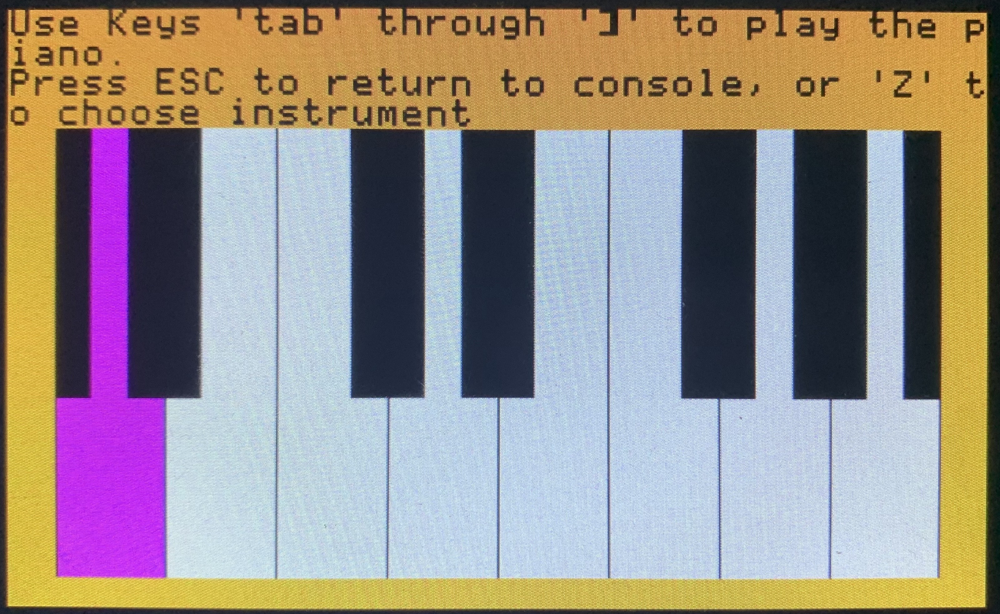

# Bare Metal Musical Keyboard on the Raspberry Pi

FILE STRUCTURE: 
- app is musical_ps2_keyboard.c
- Test file is project-tests.c
  - use audio driver to control audio output with PWN through audio jack
  - use keyboard driver to initiate notes (shell.c for now). 
  - use graphic modules to display piano graphic on console with a shell to select        intruments, etc. 
  
## How to Make program:
- `make install` builds the application, boots shell from console on Pi.
- `make test` compiles testing module, boots shell in terminal.

How to play different notes: (Thanks Liana for helping us understand!) 
- Figure out the frequency for each note. 
- Solve for x : Frequency = x.(9,600,000/ (256 * 256))
- Convert the x in a binary fraction
  - https://www.exploringbinary.com/binary-converter/

| Keyboard | Scancode | Note Name | Frequency (Hz) | Phase       | Phase as Binary Fraction    |
|----------|----------|-----------|----------------|-------------|-----------------------------|
| tab      | 0x0d     | A         | 220.000        | 1.50186667  | 1.100000000111101001010101  | 
| Q        | 0x15     | A#        | 233.082        | 1.59117312  | 1.100101110101011100011111  | 
| W        | 0x1d     | B         | 246.942        | 1.68579072  | 1.101011111000111111111011  | 
| E        | 0x24     | C         | 261.626        | 1.78603349  | 1.110010010011100101111101  | 
| R        | 0x2d     | C#        | 277.183        | 1.89223595  | 1.111001000110100110010011  | 
| T        | 0x2c     | D         | 293.665        | 2.00475307  | 10.000000010011011101111111 | 
| Y        | 0x35     | D#        | 311.127        | 2.12396032  | 10.000111111011101111011101 | 
| U        | 0x3c     | E         | 329.628        | 2.25026048  | 10.010000000001000100010010 | 
| I        | 0x43     | F         | 349.228        | 2.384063147 | 10.011000100101000111110110 | 
| O        | 0x44     | F#        | 369.994        | 2.525825707 | 10.100001101001110010000011 |
| P        | 0x4d     | G         | 391.995        | 2.6760192   | 10.101011010000111110011000 |
| [{       | 0x54     | G#        | 415.305        | 2.8351488   | 10.110101011100110001001111 |
| ]}       | 0x5b     | A_upper   | 440.000        | 3.0037333   | 11.000000001111010010101010 | 

